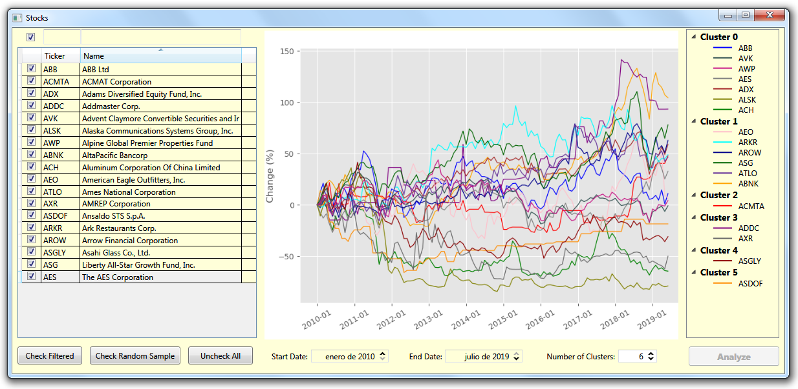

# ThomasWellerPythonrunner

Just a compilation on appveyor.

All credits to:
https://www.codeproject.com/Articles/5165602/Using-Python-Scripts-from-a-Csharp-Client-Includin

Tested on Windows 7 64 bits

The appveyor artifact is an exe for 32 bits.
Get the artifact from **appveyor**, unzip in any location. Create in the same location the directories **data**, **scripts** and **x86**.
Copy in **data** <i>stockdata.sqlite</i>, in **scripts** the <i>python files</i> and copy in **x86** <i>SQLite.Interop.dll</i>

In python 3.7 :

- pip install numpy
- pip install pandas
- python -m pip install -U matplotlib
- pip install SQLAlchemy
- pip install scipy
- pip install -U scikit-learn

